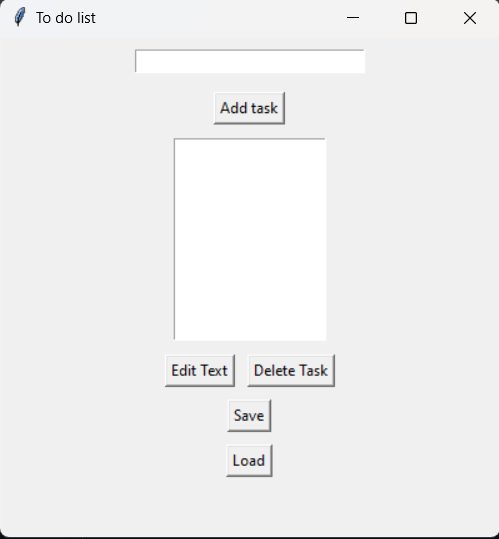

# Todo List Application using Tkinter

This is a simple Todo List application built using Python's Tkinter library. The application allows users to add, delete, and edit tasks. It also provides options to load tasks from a file and save tasks to a file.

## Features

- **Add Task:** Add a new task to the todo list.
- **Delete Task:** Remove a selected task from the list.
- **Edit Task:** Modify an existing task.
- **Load from File:** Load tasks from a text file.
- **Save to File:** Save the current list of tasks to a text file.

## 📸 Screenshot

  

## Install Required Libraries:

Ensure you have Python installed. Tkinter is included with Python, so no additional installation is needed for Tkinter.
